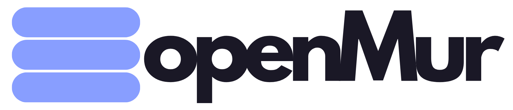
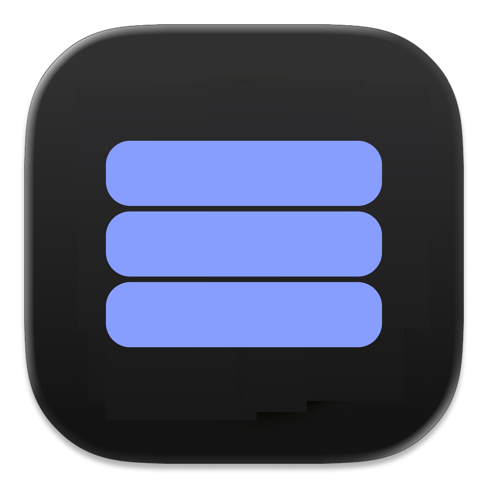

<p align="center">
  <picture>
    <source media="(prefers-color-scheme: dark)" srcset="src/assets/openMur-logo-light-text.png">
    <source media="(prefers-color-scheme: light)" srcset="src/assets/openMur-logo-dark-text.png">
    
  </picture>
</p>

<p align="center">
  
</p>

<p align="center">
  <strong>Local-first voice dictation for your desktop.</strong><br>
  Press a hotkey, speak, get text — Whisper runs on your machine.
</p>

<p align="center">
  
  
  
  
</p>

<p align="center">
  <a href="#install">Install</a>
  ·
  <a href="#features">Features</a>
  ·
  <a href="#build-from-source">Build from source</a>
  ·
  <a href="#license">License</a>
</p>

---

## What is openMur?

**openMur** is a privacy-first dictation app. Hold a global hotkey, talk, and your words are transcribed **locally** with whisper.cpp — your audio never leaves your device.

No cloud account. No telemetry. Optional AI text cleanup only if **you** add your own API key in the app settings.

## Features

| | |
|---|---|
| **Local transcription** | Whisper runs on-device; models download on first use |
| **Global hotkey** | Push-to-talk or tap-to-talk from any app |
| **Dictation pill** | Minimal overlay while you speak |
| **Auto-paste** | Inserts text at your cursor (Linux: `xdotool`, `wtype`, or `ydotool`) |
| **History** | Recent dictations kept locally (auto-expire after 5 minutes) |
| **Optional AI cleanup** | Your own OpenAI, Anthropic, or Gemini key — off by default |
| **Cross-platform** | Linux, macOS, and Windows |

## Install

### Build from source (recommended today)

Requires **Node.js 24+** (see `.nvmrc` in this repo).

```bash
git clone https://github.com/srbinov/openMur.git
cd openMur
npm ci
npm run sync:icons
npm run build:local:deb        # Linux .deb
npm run build:local:appimage   # Linux AppImage
```

Install the `.deb`:

```bash
sudo dpkg -i dist/openmur-*-linux-amd64.deb
sudo apt-get install -f -y
sudo chown root:root /opt/openMur/chrome-sandbox
sudo chmod 4755 /opt/openMur/chrome-sandbox
```

Launch from your app menu, or run `openmur` if `/usr/local/bin/openmur` exists.

### Pre-built downloads

When release builds are published, they will appear on the **Releases** tab of this repository (`github.com/srbinov/openMur` → Releases). There are no release files yet — use **Build from source** above.

## Build from source

Same steps as [Install → Build from source](#build-from-source-recommended-today). Artifacts land in `dist/`.

Before you publish a fork or share a build:

```bash
npm run check:secrets
```

Never commit API keys. Keys belong in the app’s Settings (encrypted on your machine).

## First run

1. Grant **microphone** access when prompted.
2. Set a **hotkey** in Settings → Hotkeys.
3. Hold the hotkey, speak, release — text is pasted at your cursor.

On Linux Wayland, the packaged app uses XWayland for reliable overlay positioning.

## Tech stack

React 19 · TypeScript · Tailwind CSS v4 · Electron 41 · whisper.cpp · better-sqlite3

## Contributing

You can **clone, fork, and modify** openMur for yourself under the MIT license.

This repository does **not** accept direct pushes from the public. To suggest changes:

1. Fork the repo on GitHub.
2. Make changes on your fork.
3. Open a pull request here.

## License

MIT — see [LICENSE](LICENSE).

Derived from OpenWhispr (MIT, Copyright (c) 2024 OpenWhispr Team). openMur is an independent local-first fork.
